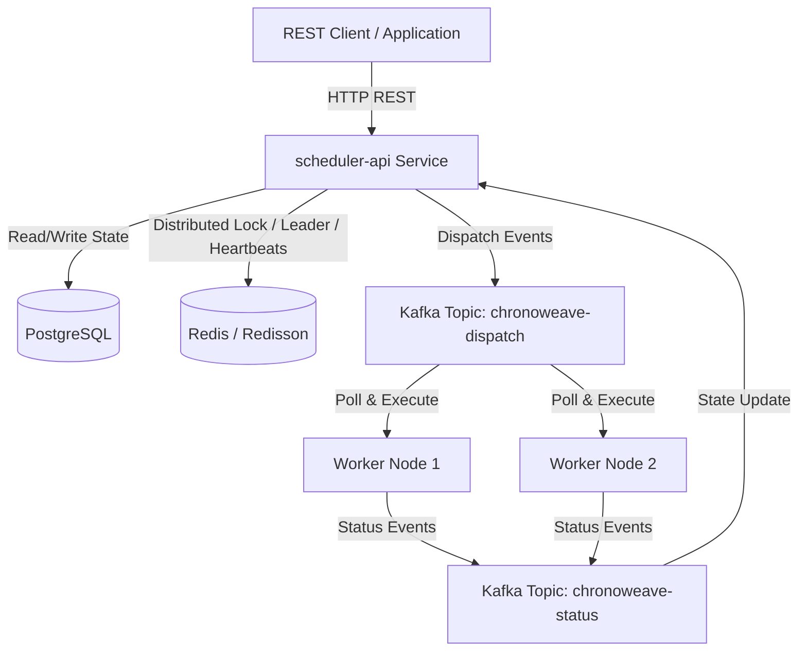

# Chronoweave

[](https://github.com/SadhviRachamalla/Chronoweave/actions/workflows/ci.yml)
[](LICENSE)

**Chronoweave** is a high-performance, fault-tolerant Distributed Job Scheduling & Workflow Platform built with Java 21, Spring Boot 3, PostgreSQL, Apache Kafka, and Redis/Redisson.

## Problem Statement
Modern microservices ecosystems require asynchronous job processing with deterministic priority execution, idempotency, DAG workflow dependencies, and crash resilience. Existing solutions are either heavy enterprise systems or simplified in-memory queues. Chronoweave provides a robust distributed execution engine with leader election, capability-based worker dispatch, exponential backoff retries, and dead-letter queue (DLQ) inspection.

## Architecture


## State Machine
```
                       +-----------+
                       |  PENDING  | (Submitted)
                       +-----------+
                             |
                             v
                       +-----------+
             +-------->|  QUEUED   |<----------------------+
             |         +-----------+                       |
             |               |                             |
             |               v                             |
             |         +-----------+                       |
             |         |  RUNNING  |                       |
             |         +-----------+                       |
             |          /    |    \                        |
             |         /     |     \                       |
       Retry |        v      v      v                      | Requeue
    Backoff  |    +-------+ +-----+ +---------------+      |
             +----|RETRYING||SUCC.| | DEAD_LETTERED |------+
                  +-------+ +-----+ +---------------+
                               |
                               +----> +-----------+
                                      | CANCELLED |
                                      +-----------+
```

## Features
- **Idempotency Key**: Guarantees duplicate job submissions return original job entity without duplicate processing.
- **Priority Scheduling & Aging**: Prevents task starvation by boosting priority of queued jobs on each cycle.
- **DAG Workflow Dependencies**: Cycle detection via DFS ensures jobs execute only when all parent tasks succeed.
- **Distributed Leader Election**: Redisson distributed locking ensures single active scheduler loop with zero double-dispatch.
- **Capability & Slot Matching**: Workers declare max slots and capabilities (`DEFAULT`, `COMPUTE`, `HEAVY`).
- **Resilience & Fault Recovery**: Stale worker detection automatically re-queues mid-flight jobs. Exponential backoff with jitter for retries.

## Stack
- **Language & Runtime**: Java 21 (Temurin)
- **Framework**: Spring Boot 3.3.4
- **Database & Migrations**: PostgreSQL, Flyway
- **Messaging**: Apache Kafka
- **Caching & Locks**: Redis, Redisson
- **Build & CI**: Apache Maven, GitHub Actions
- **Containerization**: Docker Compose

## Quickstart & Docker Setup
```bash
# 1. Clone repository
git clone https://github.com/SadhviRachamalla/Chronoweave.git
cd Chronoweave

# 2. Copy environment file
cp .env.example .env

# 3. Build & start full infrastructure stack
docker-compose up --build -d
```

## REST API Examples
```bash
# Submit ECHO Job
curl -X POST http://localhost:8080/api/v1/jobs \
  -H "Content-Type: application/json" \
  -d '{
    "name": "Quick Task",
    "jobType": "ECHO",
    "payload": {"message": "Hello World"},
    "priority": 5
  }'

# Submit Idempotent Job
curl -X POST http://localhost:8080/api/v1/jobs \
  -H "Content-Type: application/json" \
  -d '{
    "idempotencyKey": "key-123",
    "name": "Unique Task",
    "jobType": "ECHO"
  }'

# Get Job Details
curl http://localhost:8080/api/v1/jobs/detail/{jobId}

# Requeue DLQ Job
curl -X POST http://localhost:8080/api/v1/jobs/detail/{jobId}/requeue
```

## Verification & Test Results
- **Unit Tests**: Executed `mvn clean test` across all modules: **100% Passed (7/7 unit tests: JobState, BackoffUtil, DagValidation, JobServiceUnitTest, WorkerExecutorsUnitTest)**.
- **Docker Compose**: Live verified PostgreSQL 16, Redis 7, Kafka 3.7, `scheduler-api`, `worker-1`, `worker-2`.
- **Clean Build**: Compiled successfully on OpenJDK 21 & Maven 3.9.

## Design Decisions & Trade-Offs
- **At-Least-Once Delivery**: Guaranteed via Kafka acknowledgement + worker execution state checks.
- **Single Monorepo**: Modular Maven layout isolates shared domain/DTOs from scheduler control loop and worker processes.

## License
MIT License - see [LICENSE](LICENSE) file for details.
